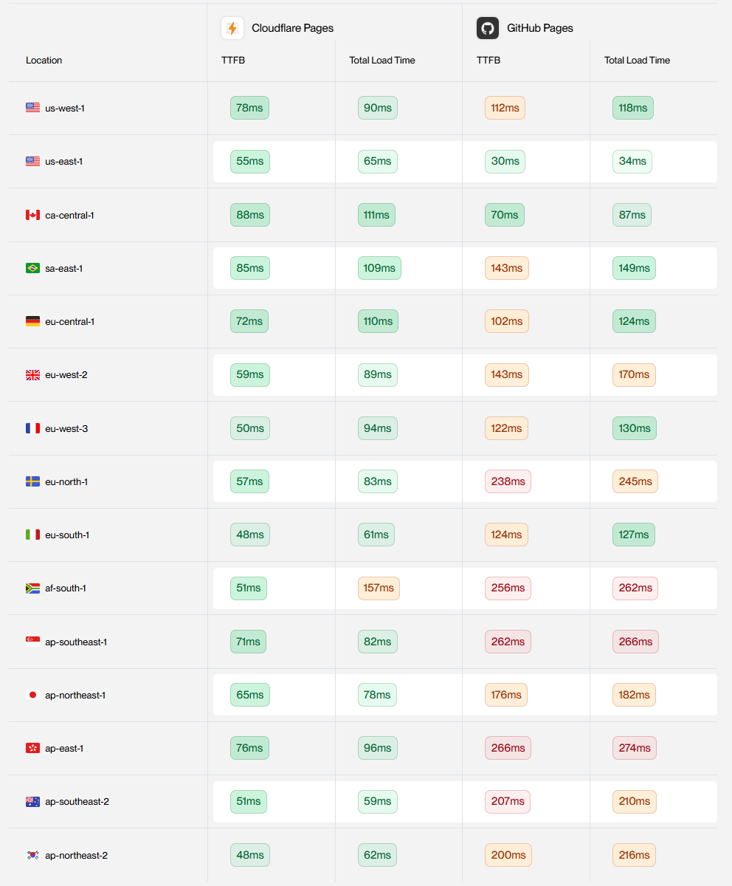
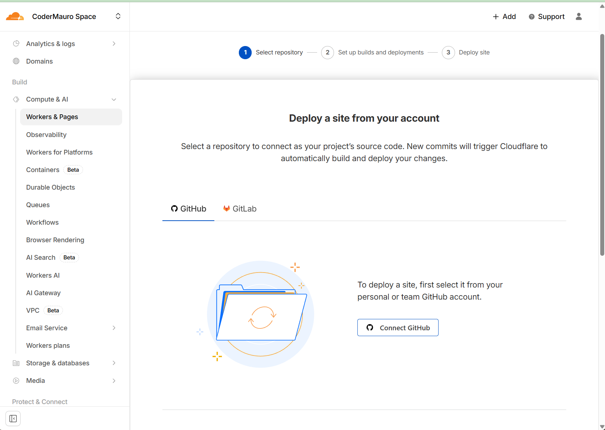

# Hosting
Hi, this website is currenlty hosted on GitHub Pages.
Reason: it's easy, and free.

# Curiosity
Years ago, I set up this website on a raspberry pi. After that I learned about github pages and learned how to connect it with a custom domain.
But around a year ago, I discovered cloudflare. Right now, I have everything hosted with cloudflared tunnels etc. Except this website, which is still on github pages.
So I thought, why not move it to cloudflare pages, or even better alternatives? We need to dig deeper. XD

# Speeeeeeedddd 🚤
Github pages is quite fast, escpecially because i previously hosted on a raspberry pi.
So we need to do some speed tests before moving to something else.
According to [some online speed test](https://bejamas.com/compare/cloudflare-pages-vs-github-pages),

The cloudflare pages are a lot faster, especialy outside the US.
So let's test it ourselves :)
I used https://www.dotcom-tools.com/ (you need to be company for some reason, so i signed up with my maurodruwel.be email lol) for website speed test, web server speed test and ping speed test.
Here are the results for github pages:

# Moving to Cloudflare Pages
After seeing the speed test results, I decided to move my website to cloudflare pages.
The process was quite simple, I just had to connect my github repository to cloudflare pages and deploy it.

